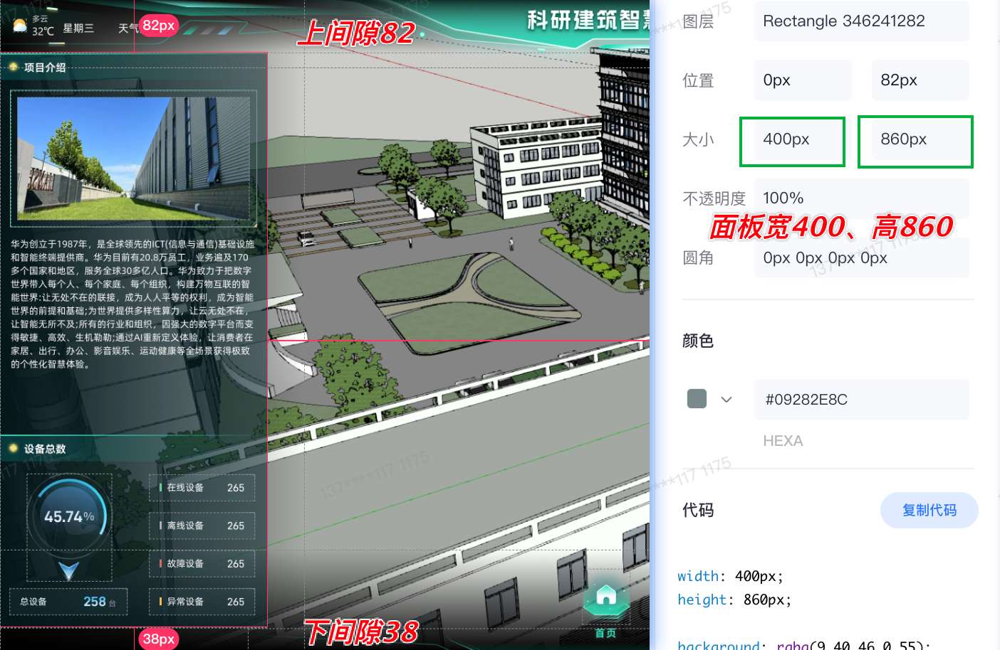

# heluo-sys-config
河洛-科研建筑智慧运营平台-v2（支持api、用户名密码可配置化版本）

# 排版尺寸
1、一整屏高度按980px基数来算
2、左、右两边的面板一整块的高度值，设计稿上是860px.
  面板距离顶部间隙：82px;
  面板距离底部间隙：38px;
  加起来：82 + 38 + 860 = 980px
3、要求不同尺寸分辨率下，左、右两边的面板一整块做到能够都能够按照设计稿那样，铺满。
  所以在CSS设计尺寸时，按照vh的占比来设置高度。
  比如首页项目介绍整个豆腐块高度在设计稿中是300px, 那么它的高度就设置为：
  300 / 980 = 0.306, 即0.306 * 100 = 30.6vh
  其他豆腐块以此类推。

  
4、为了保证美观性，左右两边的面板高度尽量一样高，所有两边加起来的高度需要一样。
  均是： （860 / 980）* 100 ~= 88vh